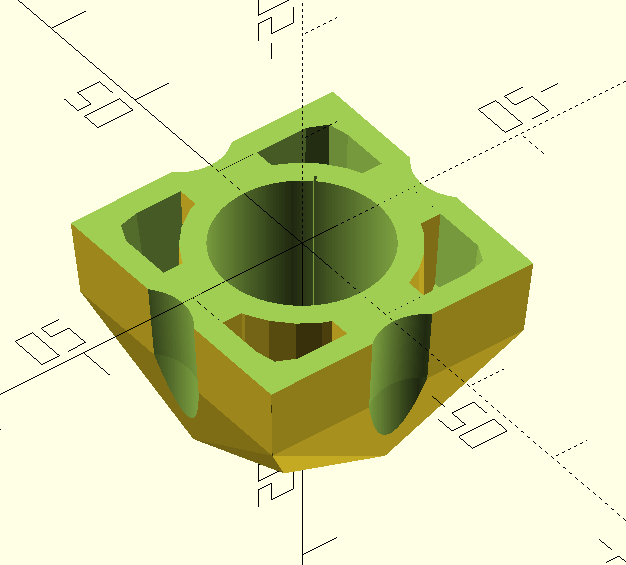
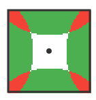
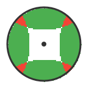
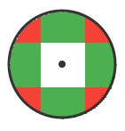
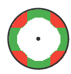

# Concave Actuator
A 3d printed concave actuator for an IL/Eurostick

## Why would I want this?

A normal sanwa joystick has plunger switches and a round actuator. If you look at the geometry when it makes contact with the switches, it is more sensitive at cardinal angles, and the activation map looks like this:

This shape complements a square gate, which tends to reflect up and down a little bit when you push against a cardinal angle.

If you install a round gate, you no longer have the same gate reflection, but you have dramatically smaller diagonal areas:

An IL/Eurostick joystick uses square actuator and a round "collar" which means the activation map looks something like this:

You also get a near identical activation map from a Seimitsu or Korean-lever style with lever switches and a round actuator.

The observation that prompted this is, what does it look like if we had non-square sides? Using the same actuator simulator making shallow round cutouts in the side you can get an activation map that looks like this:

The actual activation area at the cardinals is slightly different because the square actuator is free-spinning which is difficult to simulate, but it "squares" itself whenever it makes contact with two switches.

## Why would you want this shape?

In my time spent tinkering with sticks, the most desirable properties are:

1. Large area diagonals (makes them easy to find)
2. Wide cardinal zones (makes dashing easier and prevents accidental jumps)
3. Shallow cardinal zones (makes dashing faster)

A concave actuator can achieve these properties better than other actuator types.

# Releases

In the releases you can find pre-bilt zip files that have a number of actuator shapes to experiment with, with sizes that show the width and depth of the cutout.

In my personal testing I found a width of 6mm and depth of 1mm to feel nice.
